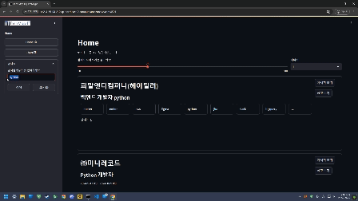

# 

## *TechMap IT*?

**TechMap IT**는 수많은 채용 사이트들에서 여러 공고들을 수집하고 분석해 여러 공고들과 함께 특정 업무 분야에 대해서 실제로 각광받거나 많이 사용되는 기술 스택의 목록을 제시하는 시스템을 구성하기 위한 프로젝트입니다.

## Abstract

단순히 컴퓨터를 다루거나 코드를 작성하는 수준으로 취업을 준비하기에는 IT 직종에서 요구하는 기술의 종류와 깊이가 매우 다양합니다.

IT 분야에 취직하고자 하는 사람들은 해당 분야에서 깊이 있게 몇 년을 공부하지 않는 이상, 어떤 기술을 공부해야 할지 감을 잡기 어려운 상황입니다. 최근 채용 시장에서는 한 가지 기술에 특화된 스페셜리스트보다 다양한 기술 스택을 경험한 제네럴리스트를 선호하는 경향이 커지고 있습니다.

그러나 개인이 어떤 기술이 현재 각광받는지, 그리고 실제 업무에서 많이 사용되는지를 알기 위해서는 단순한 검색으로는 한계가 있습니다. 본 프로젝트는 이러한 문제를 해결하고자 합니다.

특정한 업무 분야에서 여러 채용 공고를 분석하여, 기업들이 필요로 하는 기술 스택의 목록을 추천하는 시스템을 구현합니다.

## Project Architecture Overview

시스템 아키텍처를 구성하기 위해 사용된 스택은 다음과 같습니다.

|Stack Name | Purpose|
|---|---|
|Amazon Web Services | 프로젝트의 아키텍처를 구성하기 위해 사용된 스택의 대부분은 AWS 상으로 구현되었습니다.|
|Airflow | 데이터 파이프라인을 구축하고 스케줄링하기 위해 사용했습니다.|
|AWS Lambda | Python으로 작성된 코드들을 서버리스 환경에서 실행하기 위해 사용했습니다.|
|AWS S3 | 초기 정제되지 않은 파일 형식의 데이터들을 저장하기 위해 사용했습니다.|
|AWS DynamoDB | 분석된 데이터를 NoSQL 방식으로 저장하고 빠르게 액세스하기 위해 사용했습니다.|
|AWS RDS | 분석된 데이터를 SQL 방식으로 저장하고 빠르게 액세스하기 위해 사용했습니다. 특히 MySQL 데이터베이스를 구축하는 데 사용되었습니다.|
|FastAPI | DB와 웹 사이의 RESTful API 통신 규격을 구현하기 위해 사용했습니다.|
|Streamlit | 웹 인터페이스를 구현하기 위해 사용했습니다.|

직접적으로 시스템을 구성하는 것 이외의 개발에 사용된 스택은 다음과 같습니다.

|Stack Name | Purpose|
|---|---|
|GitHub |소스 코드를 관리하고 어플리케이션을 배포하기 위해  사용했습니다. |
|Google Docs | 프로젝트 문서를 작성하기 위해 사용했습니다. |
|Containerd | 독립적인 환경에서 어플리케이션을 실행하기 위해 사용했습니다. |
|Kubernetes | 컨테이너화된 어플리케이션을 관리하기 위해 사용했습니다. |
|Pandas | 대용량 데이터에 대한 탐색적 데이터 분석(EDA)을 실행하기 위해 사용했습니다. |
|Gemini LLM | LLM을 통해 대용량 데이터에서 관계형 데이터프레임의 형태로 변환할 때 빈 값들을 채우는 과정을 자동화하기 위해 사용했습니다. |

### Pipeline Flow

1. 데이터 수집 단계: AWS Lambda와 AWS Eventbridge로 채용 사이트에서 공고 데이터를 주기적으로 수집하고 S3에 저장합니다. 이 과정에서, 수집의 결과 및 완료 여부를 SQS를 통해 Airflow에 전달해 DAG를 작동시킵니다.

2. 데이터 정제 단계: Lambda를 통해 수집되어 AWS S3에 저장된 데이터는 Medallion 아키텍처를 토대로 데이터의 질적 수준에 따라 단계별로 정제됩니다. Pandas를 통해 1차 전처리 작업을 진행한 후, Gemini LLM을 통해 파편화되어 있는 비정형적인 정보를 정형화된 데이터로 2차 전처리 작업을 진행해 DynamoDB에 저장합니다. 최종적으로 관계형 데이터베이스에 적합하게 3차 전처리 작업을 진행한 뒤 RDS에 저장하는 것으로 정제가 완료됩니다.

3. 시각화 단계: AWS RDS로 구축된 MySQL 데이터베이스로부터 FastAPI와 sqlalchemy를 통해 RESTful API를 구현해 백엔드 서버를 구축했습니다. 이 API 서버와 통신하며 최종적으로 데이터를 받아 사용자에게 시각화하는 프론트엔드 서버는 Streamlit를 통해 구축했습니다. 프론트엔드 서버에서는 사용자에게 채용 공고 데이터를 제공하고, 빈도가 높은 상위 10개의 기술 스택에 대한 시각화 지표를 제공합니다.

4. 모니터링 및 유지보수 단계: AWS CloudWatch를 통해 Cloud 상으로 구축된 파이프라인 구성 요소에 대한 로그를 수집하고, Prometheus를 통해 On-Premise Kubernetes로 구축된 파이프라인 구성 요소들에 대한 로그를 수집하여 Grafana를 통해 전체 파이프라인을 모니터링하기 위한 대시보드 웹 인터페이스를 제공합니다. 또한, Airflow DAG를 통해 대부분의 파이프라인 핵심 이벤트들이 호출되기 때문에 Airflow의 웹 서버를 통해 각 DAG의 동작을 모니터링합니다.
파이프라인의 유지보수에 핵심적인 요소는 총 4가지로, AWS Lambda를 통해 구현된 크롤러 코드, 전체 오케스트레이션을 위한 Airflow DAG 코드, 웹 인터페이스의 백엔드 단계에 해당하는 FastAPI 코드, 웹 인터페이스의 프론트엔드 단계에 해당하는 Streamlit 코드입니다. 이 코드들을 지속적으로 유지/보수하기 위해 Airflow의 Git Sync 기능과 Github Actions를 활용해 CI / CD 파이프라인을 구축했습니다.