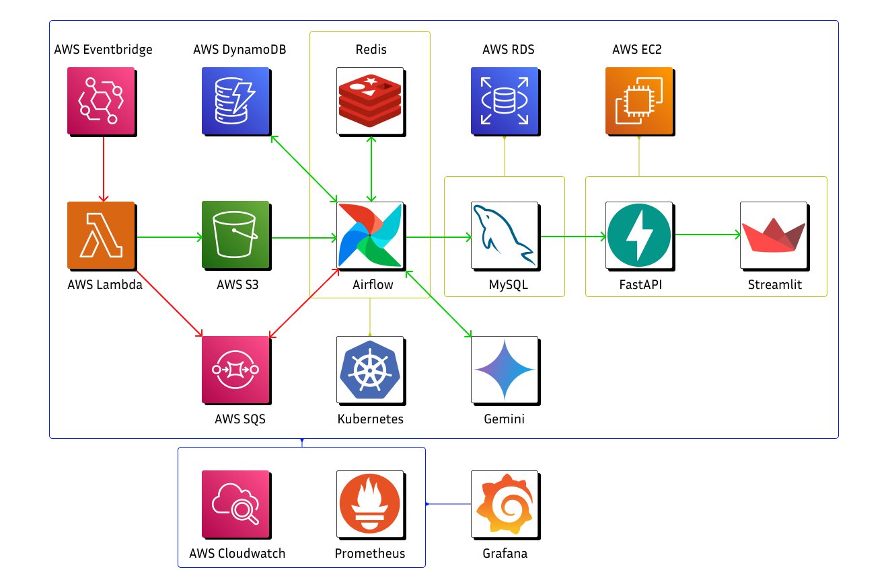

# FPT5

## 목표

이 프로젝트는 수많은 채용 사이트들에서 여러 공고들을 수집하고 분석해 여러 공고들과 함께 특정 업무 분야에 대해서 실제로 각광받거나 많이 사용되는 기술 스택의 목록을 제시하는 시스템을 구성하기 위한 것입니다.

## 개요

단순히 컴퓨터를 다루거나 코드를 작성하는 수준으로 취업을 준비하기에는 IT 직종에서 요구하는 기술의 종류와 깊이가 매우 다양합니다.

IT 분야에 취직하고자 하는 사람들은 해당 분야에서 깊이 있게 몇 년을 공부하지 않는 이상, 어떤 기술을 공부해야 할지 감을 잡기 어려운 상황입니다. 최근 채용 시장에서는 한 가지 기술에 특화된 스페셜리스트보다 다양한 기술 스택을 경험한 제네럴리스트를 선호하는 경향이 커지고 있습니다.

그러나 개인이 어떤 기술이 현재 각광받는지, 그리고 실제 업무에서 많이 사용되는지를 알기 위해서는 단순한 검색으로는 한계가 있습니다. 본 프로젝트는 이러한 문제를 해결하고자 합니다.

특정한 업무 분야에서 여러 채용 공고를 분석하여, 기업들이 필요로 하는 기술 스택의 목록을 추천하는 시스템을 구현합니다.

## 프로젝트 아키텍처 개요

시스템 아키텍처를 구성하기 위해 사용된 스택은 다음과 같습니다.

|Stack Name | Purpose|
|---|---|
|Amazon Web Services | 프로젝트의 아키텍처를 구성하기 위해 사용된 스택의 대부분은 AWS 상으로 구현되었습니다.|
|Airflow | 데이터 파이프라인을 구축하고 스케줄링하기 위해 사용했습니다.|
|AWS Lambda | Python으로 작성된 코드들을 서버리스 환경에서 실행하기 위해 사용했습니다.|
|AWS S3 | 초기 정제되지 않은 파일 형식의 데이터들을 저장하기 위해 사용했습니다.|
|AWS DynamoDB | 분석된 데이터를 NoSQL 방식으로 저장하고 빠르게 액세스하기 위해 사용했습니다.|
|AWS RDS | 분석된 데이터를 SQL 방식으로 저장하고 빠르게 액세스하기 위해 사용했습니다. 특히 MySQL 데이터베이스를 구축하는 데 사용되었습니다.|
|FastAPI | DB와 웹 사이의 RESTful API 통신 규격을 구현하기 위해 사용했습니다.|
|Streamlit | 웹 인터페이스를 구현하기 위해 사용했습니다.|

직접적으로 시스템을 구성하는 것 이외의 개발에 사용된 스택은 다음과 같습니다.

|Stack Name | Purpose|
|---|---|
|GitHub |소스 코드를 관리하고 어플리케이션을 배포하기 위해  사용했습니다. |
|Google Docs | 프로젝트 문서를 작성하기 위해 사용했습니다. |
|Containerd | 독립적인 환경에서 어플리케이션을 실행하기 위해 사용했습니다. |
|Kubernetes | 컨테이너화된 어플리케이션을 관리하기 위해 사용했습니다. |
|Selenium | 웹 크롤링을 위해 사용했습니다. |
|Pandas | 대용량 데이터에 대한 탐색적 데이터 분석(EDA)을 실행하기 위해 사용했습니다. |
|Gemini LLM | LLM을 통해 대용량 데이터에서 관계형 데이터프레임의 형태로 변환할 때 빈 값들을 채우는 과정을 자동화하기 위해 사용했습니다. |

### 작동 파이프라인

1. 크롤링: AWS Lambda를 사용하여 다양한 채용 사이트에서 공고를 크롤링하고, S3에 저장합니다.
2. 데이터 정제: Airflow로 데이터를 정제하고, DynamoDB 및 RDS에 저장합니다.
3. 데이터 분석: Pandas를 사용하여 정제된 데이터를 분석하고, 필요에 따라 Gemini LLM을 통해 데이터를 자동으로 보완합니다.
4. API 제공: FastAPI를 통해 분석된 데이터와 기술 스택 정보를 API로 제공합니다.
5. 시각화: Streamlit을 사용하여 사용자 인터페이스를 구현하고, 최종적으로 추천된 기술 스택과 채용 정보를 시각화합니다.