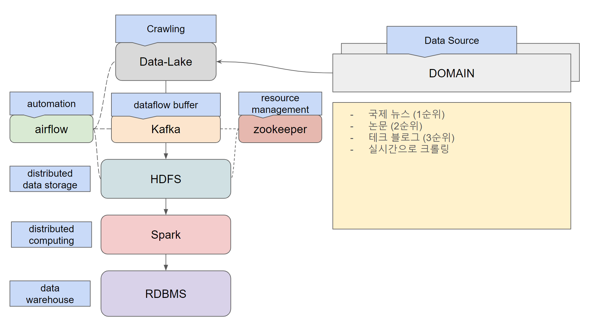

# DE31-3rd_team5

## 목표
이 미니 프로젝트의 목표는 Playdata 코딩 부트캠프의 31기 데이터 엔지니어링 과정 동안 최종 프로젝트를 위한 기본 배경을 구축하는 것입니다.

## 프로젝트 아키텍처 개요


|프레임워크|사용 목적|
|---|---|
|Python|프로젝트에서 사용된 기본 언어|
|HDFS|클러스터 컴퓨터의 데이터 레이크|
|Kafka|대용량 데이터를 HDFS에 안정적으로 전달하기 위한 버퍼링|
|Spark|분산 컴퓨팅 환경에서 대용량 데이터에 대한 EDA 실행|
|MySQL(MariaDB)|분석된 데이터를 저장하고 빠르게 액세스하기 위해 사용|
|Airflow|각 데이터 크롤링-저장-분석 과정을 자동화|

## 환경 요약
- Python 3.10.12
- Spark 3.5.1
- Hadoop 3.3.6
- Kafka 2.13-3.2
- mariadb-lts 11.2.4-1

## 설치
### 1. Hadoop
프로젝트 내에서 사용된 Hadoop 클러스터는 미리 구축된 클러스터이므로, 이 문서에서는 Hadoop 및 클러스터 설치 방법에 대해 설명하지 않습니다.

빠른 시작을 위해 [공식 튜토리얼](https://hadoop.apache.org/docs/stable/hadoop-project-dist/hadoop-common/SingleCluster.html)을 참고하세요!

### 2. Spark
우리는 16GB RAM과 4코어를 가진 2대의 머신을 worker로, 12GB RAM과 4코어를 가진 1대의 머신을 master로 결합하여 Spark 클러스터를 구성했습니다. 

더 나은 환경과 컴퓨팅 성능을 위해 더 많은 RAM과 코어를 가진 머신을 사용하는 것을 추천합니다.

설치 과정은 비교적 간단했습니다.
1) [공식 웹사이트](https://dlcdn.apache.org/spark/spark-3.5.1/spark-3.5.1-bin-hadoop3.tgz)에서 Spark tar 파일을 다운로드합니다.

터미널에서 **wget**을 사용하여 이 작업을 수행할 수 있습니다.

```bash
wget https://dlcdn.apache.org/spark/spark-3.5.1/spark-3.5.1-bin-hadoop3.tgz
```
2) 다운로드한 tar 파일을 풀고 원하는 위치에 배치합니다.

예를 들어, 압축을 푼 파일을 "spark"로 간단히 이름을 변경하고 /opt/ 디렉토리에 배치했습니다.

이 과정에서는 **tar** 명령과 **mv** 명령을 사용할 수 있습니다.

```bash
tar xvfz spark-3.5.1-bin-hadoop3.tgz
sudo mv spark-3.5.1-bin-hadoop3 /opt/spark/
sudo chown -R hadoop:hadoop /opt/spark
```

3) 환경 변수를 설정합니다.

이 과정을 통해 필요한 환경 변수를 ~/.bashrc 파일에 추가할 수 있습니다.

```bash
vim ~/.bashrc
```

추가할 내용은 다음과 같습니다.

```bash
export SPARK_HOME=/opt/spark
export PATH=$SPARK_HOME/bin:$PATH
```

환경 변수를 적용합니다.

```bash
source ~/.bashrc
```

4) Spark 클러스터 구성 파일을 설정합니다.

`/opt/spark/conf/` 디렉토리에 있는 `spark-env.sh.template` 파일의 이름을 `spark-env.sh`로 변경하고 편집합니다.

```bash
mv /opt/spark/conf/spark-env.sh.template /opt/spark/conf/spark-env.sh
vim /opt/spark/conf/spark-env.sh
```

내용에 다음을 추가합니다.

```bash
SPARK_MASTER_HOST='master-node'
SPARK_WORKER_CORES=4
SPARK_WORKER_MEMORY=16g
```

마찬가지로, workers 파일에 워커 노드들을 추가합니다.

```bash
vim /opt/spark/conf/workers
```

파일에 다음과 같은 내용을 추가합니다.

```sh
node1
node2
```

5) Spark 클러스터를 실행하고 테스트합니다.

각 포트가 열려 있고 연결 가능하도록 방화벽 구성을 확인하고, 각 worker가 활성화되어 연결 가능한지 확인해야 합니다.

### 3. Airflow

Python 환경은 설치된 패키지에 따라 다르므로, 이 프로젝트에서는 가상 환경을 사용합니다.

이 프로젝트에서는 Python 3.10.12를 사용했습니다.

이 문서에서는 Python 설치에 대해 설명하지 않으며, Python이 설치되어 있다고 가정합니다.

1) 가상 환경 생성.

conda를 사용할 수도 있지만, 이 프로젝트에서는 사용하지 않았으므로 표준 가상 환경을 기준으로 설명합니다.

```bash
python3 -m venv .venv
```

2) pip을 사용하여 Airflow 설치.

가상 환경을 활성화합니다.

```bash
source .venv/bin/activate
```

최신 Airflow를 설치하기 위해 pip을 업데이트합니다.

```bash
python -m pip install -U pip
```

Airflow 설치.

```bash
pip install apache-airflow
```

3) 설정 구성.

설치 후, 홈 디렉토리에 *airflow/* 디렉토리가 생성됩니다.

기본적으로 airflow/ 디렉토리에는 *dags/* 디렉토리가 없습니다.

따라서 디렉토리를 만듭니다.

```bash
mkdir ~/airflow/dags
```

추가 환경 변수를 bash 프로파일에 추가해야 합니다.

```bash
vim ~/.bashrc
```

다음 환경 변수를 bash 프로파일에 적용합니다.

```bash
export AIRFLOW_HOME=~/airflow
```

4) Airflow 독립 실행 모드로 테스트 실행.

Airflow는 분산 컴퓨팅 환경에서도 실행할 수 있지만, 이 프로젝트에서는 독립 실행 모드로 사용합니다.

Airflow 독립 실행 모드를 활성화하려면 업데이트된 bash 프로파일과 함께 설정이 적용되어 있어야 합니다.

```bash
airflow standalone
```

DAG 설정에 사용된 예제 코드는 [여기](./airflow_sample/dag_example.py)에서 확인할 수 있습니다.
